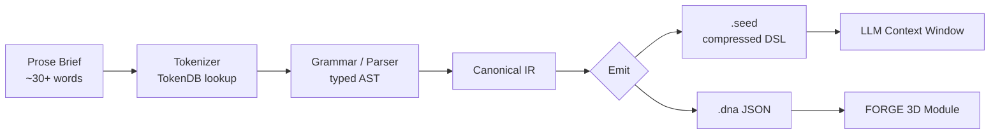

# SEED — Architecture

SEED takes prose project intent and emits two artifacts from a single pipeline: a **compressed DSL string** for direct injection into an LLM context window, and a **canonical `.dna` JSON file** for consumption by FORGE as a 3D module. Both outputs share the same intermediate representation (IR), so they stay in lockstep — the LLM and the 3D viewer always see the same model.

The pipeline is six engine units (TokenDB, Composer, Parser, Transpiler, Compressor, Storage), each a pure C# .NET 8 class with no UI or host dependencies. Prose enters via the Composer, gets normalized against the TokenDB verb/modifier registry, parses into a typed AST, transpiles into the canonical IR, and emits in either of two formats depending on the consumer. Compression measures ≥ 2× on real prose, with peak observed around 10× on dense intent statements.

